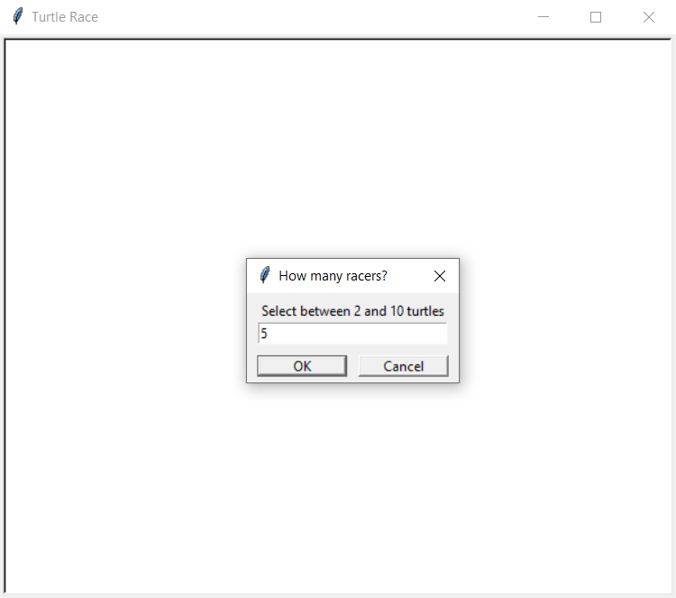
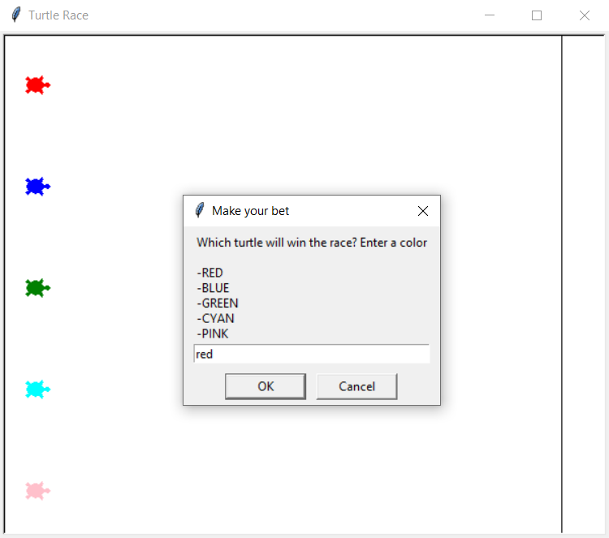
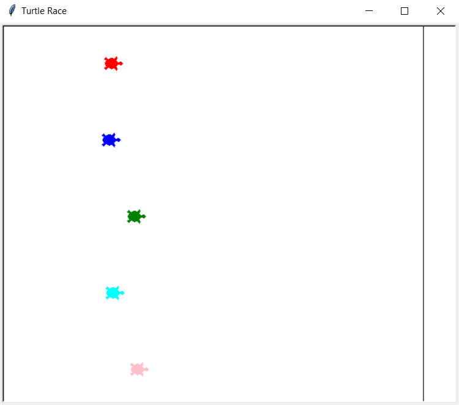
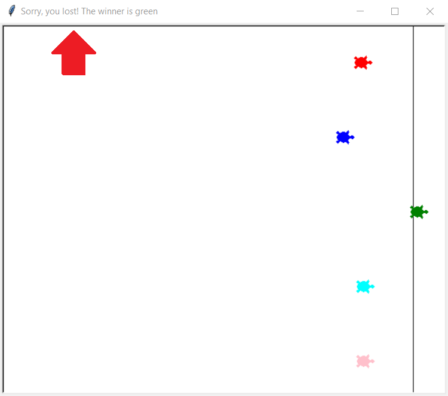

# Turtle Race

Welcome to the Turtle Race project! This is a fun and interactive Python project that simulates a race between turtles using the `turtle` module. The program sets up a race track and initializes multiple turtles with different colors. The turtles then race towards the finish line, and the first one to cross it wins.

## Prerequisites

Make sure you have Python installed on your system. You can download it from [python.org](https://www.python.org/).

## Installation and Running the Project

1. Clone the repository and navigate to the project directory.
2. Start the turtle race by running the `main.py` file:
    ```sh
    python main.py
    ```
## How it works

1. Choose between 2 and 10 turtles for the race.

<p align="center">
  
</p>

2. Bet on a turtle by selecting an available color.

<p align="center">
  
</p>

3. Run the race and watch to see if your turtle wins or loses.

<p align="center">
  
</p>

<p align="center">
  
</p>

## Contributing
This project is open-source so feel free to fork this project and submit pull requests for improvements or new features. Suggestions or enhancements are always welcome!
